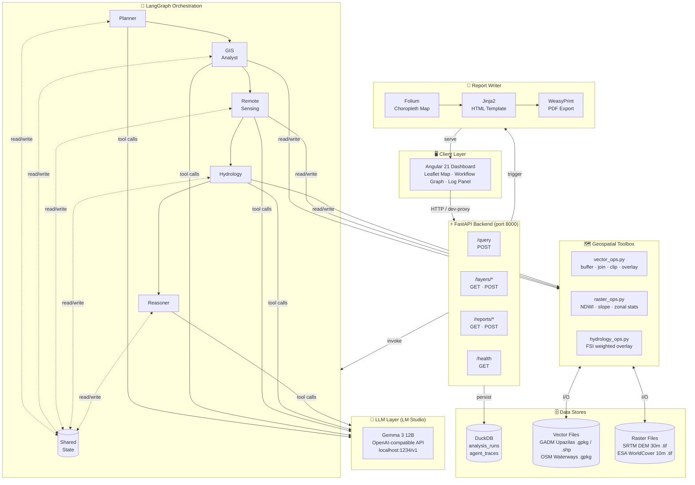
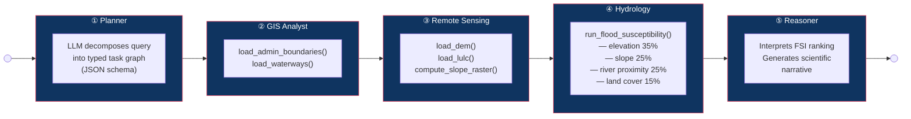
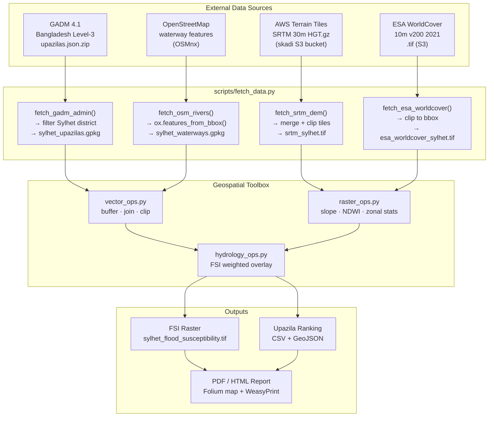

# GeoReasoner — LLM-Orchestrated Multi-Agent Geospatial Reasoning System

[](https://python.org)
[](https://fastapi.tiangolo.com)
[](https://langchain-ai.github.io/langgraph/)
[](https://angular.io)
[](LICENSE)
[](https://github.com/features/actions)
[](tests/)

> **A flagship GeoAI portfolio project demonstrating the integration of large language models, multi-agent orchestration, and geospatial analysis for environmental intelligence.**

GeoReasoner accepts natural-language queries about flood risk, autonomously decomposes them into a multi-step analysis plan, orchestrates five specialised AI agents to execute geospatial operations, and synthesises the results into a ranked scientific report — all powered by a locally-hosted LLM with no cloud API keys required.

**Case study:** Flood Vulnerability Assessment, Sylhet District, Bangladesh.

---

## Table of Contents

- [Overview](#overview)
- [System Architecture](#system-architecture)
- [Agent Pipeline](#agent-pipeline)
- [Data Pipeline](#data-pipeline)
- [Tech Stack](#tech-stack)
- [Quick Start](#quick-start)
- [Project Structure](#project-structure)
- [API Reference](#api-reference)
- [Configuration](#configuration)
- [Data Sources](#data-sources)
- [Development](#development)
- [Testing](#testing)
- [License](#license)

---

## Overview

GeoReasoner demonstrates how modern AI systems can bridge the gap between natural-language user intent and complex geospatial computation. A user asks:

> *"Which upazilas in Sylhet have the highest flood risk?"*

GeoReasoner autonomously:

1. **Plans** a multi-step analysis using Gemma 3 12B
2. **Loads** GADM admin boundaries and OSM waterway networks
3. **Ingests** SRTM 30 m DEM and ESA WorldCover 10 m land-cover
4. **Computes** a Flood Susceptibility Index (FSI) via weighted overlay
5. **Ranks** all 12 upazilas by FSI
6. **Generates** a scientific narrative and exports a PDF/HTML report
7. **Displays** an interactive choropleth map in the web dashboard

All five analysis steps execute as independent LangGraph nodes, each backed by a locally-hosted LLM — no cloud services required.

---

## System Architecture



---

## Agent Pipeline

Each LangGraph node is an autonomous agent that calls the LLM, selects tools, executes geospatial operations, and writes results back to the shared `GeoReasonerState`.



### Agent Responsibilities

| Agent | Role | Tools | LLM Behaviour |
|---|---|---|---|
| **Planner** | Decomposes NL query into a `TaskPlan` (JSON) | — | Structured JSON generation |
| **GIS Analyst** | Loads and validates admin + waterway vectors | `load_admin_boundaries`, `load_waterways` | Tool selection + argument extraction |
| **Remote Sensing** | Ingests DEM and LULC rasters, derives slope | `load_dem`, `load_lulc`, `compute_slope_raster` | Tool selection + argument extraction |
| **Hydrology** | Computes FSI via weighted overlay + zonal stats | `run_flood_susceptibility` | Tool selection with data-path context |
| **Reasoner** | Interprets FSI ranking into a scientific narrative | — | Scientific text generation |

All agents implement a **hard fallback**: if the LLM is unreachable (CI, offline), tools are called directly with state-derived arguments. This means the full pipeline runs in CI without any LLM.

---

## Data Pipeline



### Flood Susceptibility Index (FSI)

The FSI is a weighted overlay of four normalised geospatial layers:

```
FSI = 0.35 × norm_inv(elevation)
    + 0.25 × norm_inv(slope)
    + 0.25 × norm_inv(river_proximity)
    + 0.15 × lulc_vulnerability
```

Where:
- `norm_inv()` = min-max normalisation, then inverted (low elevation → high susceptibility)
- `lulc_vulnerability` = ESA WorldCover class mapped to [0, 1] via expert lookup table
- River proximity computed via `scipy.ndimage.distance_transform_edt` in pixel space, converted to metres

---

## Tech Stack

| Layer | Technology | Purpose |
|---|---|---|
| **LLM** | Gemma 3 12B (LM Studio) | All agent reasoning, tool selection, report generation |
| **LLM API** | LangChain `ChatOpenAI` + OpenAI-compatible endpoint | LM Studio integration without cloud keys |
| **Orchestration** | LangGraph `StateGraph` | Sequential multi-agent pipeline with shared typed state |
| **Backend** | FastAPI + Uvicorn | REST API, async endpoints, static file serving |
| **Geospatial vector** | GeoPandas, Shapely, PyProj, OSMnx | Admin boundaries, waterways, spatial joins, buffering |
| **Geospatial raster** | Rasterio, NumPy, SciPy | DEM ingestion, slope, proximity raster, resampling |
| **Database** | DuckDB (spatial extension) | Analysis run logging, agent trace persistence |
| **Mapping** | Folium, Leaflet.js | Interactive choropleth maps |
| **Reporting** | Jinja2, WeasyPrint | HTML template rendering → PDF generation |
| **Frontend** | Angular 21, Tailwind CSS 3, PrimeNG 21 | SPA dashboard, reactive signals-based state |
| **Testing** | pytest, pytest-asyncio, pytest-cov | 90 tests, full pipeline coverage without LLM |
| **CI/CD** | GitHub Actions | Lint (ruff), type check, full test suite on push |
| **Containers** | Docker, Docker Compose | Reproducible deployment |

---

## Quick Start

### Prerequisites

| Requirement | Version | Notes |
|---|---|---|
| Python | ≥ 3.12 | 3.14 used locally |
| Node.js | ≥ 18 | For Angular frontend |
| LM Studio | Latest | Serve Gemma 3 12B at `localhost:1234` |
| Pango | System lib | `brew install pango` (macOS) / apt on Linux |
| Docker | 24+ | Optional, for containerised run |

### Option A — Local Development

```bash
# 1. Clone
git clone https://github.com/yourname/geo-multi-agent.git
cd geo-multi-agent

# 2. Python environment
python -m venv .venv
source .venv/bin/activate          # Windows: .venv\Scripts\activate
pip install -e ".[dev]"

# 3. Download real geospatial data (requires internet, ~35 MB)
python scripts/fetch_data.py

# 4. Start LM Studio, load Gemma 3 12B, enable server at localhost:1234

# 5. Start the FastAPI backend
uvicorn georeasoner.api.main:app --reload --port 8000

# 6. (New terminal) Start the Angular dashboard
cd frontend
npm install
npm start
# → http://localhost:4200
```

### Option B — Docker Compose

```bash
# Ensure LM Studio is running on the host at port 1234
docker compose up --build

# API → http://localhost:8000
# Docs → http://localhost:8000/docs
```

### Option C — API only (no frontend)

```bash
uvicorn georeasoner.api.main:app --reload

# Run a query
curl -X POST http://localhost:8000/query \
  -H "Content-Type: application/json" \
  -d '{"query": "Which upazilas in Sylhet have the highest flood risk?"}'

# Generate PDF report
curl -X POST http://localhost:8000/reports \
  -H "Content-Type: application/json" \
  -d '{"run_id": "<run_id>", "query": "...", "fsi_ranking": [...], "agent_trace": [...]}'

# Download as PDF
curl -o report.pdf "http://localhost:8000/reports/<run_id>?format=pdf"

# Download as HTML
curl -o report.html "http://localhost:8000/reports/<run_id>?format=html"
```

---

## Project Structure

```
geo-multi-agent/
│
├── georeasoner/                   # Python package
│   ├── __init__.py                # Version: 0.1.0
│   ├── config.py                  # Pydantic Settings (env vars, bbox, paths)
│   ├── db.py                      # DuckDB connection factory + schema init
│   ├── llm.py                     # LangChain ChatOpenAI factory (LM Studio)
│   ├── state.py                   # GeoReasonerState TypedDict + Pydantic schemas
│   ├── graph.py                   # LangGraph StateGraph assembly
│   ├── data_utils.py              # ensure_*() helpers (real → synthetic fallback)
│   ├── report_writer.py           # Folium map + Jinja2 HTML + WeasyPrint PDF
│   │
│   ├── agents/                    # LangGraph node functions
│   │   ├── _utils.py              # trace_entry(), now_iso()
│   │   ├── planner.py             # Task plan decomposition
│   │   ├── gis_analyst.py         # Admin boundaries + waterways
│   │   ├── remote_sensing.py      # DEM + LULC ingestion
│   │   ├── hydrology.py           # FSI computation + upazila ranking
│   │   └── reasoner.py            # Scientific narrative generation
│   │
│   ├── tools/                     # Pure geospatial functions (no LLM)
│   │   ├── vector_ops.py          # buffer, spatial_join, clip, overlay, proximity_raster
│   │   ├── raster_ops.py          # compute_ndwi, compute_slope, zonal_stats, write_raster
│   │   └── hydrology_ops.py       # flood_susceptibility_index, ESA vulnerability map
│   │
│   ├── api/
│   │   └── main.py                # FastAPI app: /query /reports /layers /health
│   │
│   ├── templates/
│   │   └── report.html.j2         # Jinja2 PDF report template
│   │
│   └── static/
│       └── index.html             # Minimal Leaflet fallback page
│
├── frontend/                      # Angular 21 SPA
│   ├── src/app/
│   │   ├── app.component.ts       # Root 3-column layout shell
│   │   ├── app.config.ts          # Angular providers (HttpClient, PrimeNG, Router)
│   │   ├── models/types.ts        # TypeScript interfaces (RankingItem, TraceEntry…)
│   │   ├── services/
│   │   │   ├── app-state.service.ts      # Signals-based shared state
│   │   │   └── georeasoner.service.ts    # HTTP client wrapper
│   │   └── components/
│   │       ├── query-panel/       # Query textarea + Run + PDF/HTML export buttons
│   │       ├── map-view/          # Leaflet choropleth (FSI colours, admin + rivers)
│   │       ├── workflow-view/     # SVG pipeline graph with live status animation
│   │       ├── ranking-table/     # FSI ranking list with colour bars
│   │       └── log-panel/         # Agent execution trace + answer summary
│   ├── proxy.conf.json            # Dev proxy → FastAPI :8000
│   └── tailwind.config.js         # Dark theme, custom crimson/navy palette
│
├── scripts/
│   ├── fetch_data.py              # Download GADM, OSM, SRTM, ESA WorldCover
│   └── run_sylhet_susceptibility.py  # Standalone FSI script (no LLM)
│
├── tests/                         # 90 pytest tests
│   ├── conftest.py                # Synthetic GeoTIFF/GeoPackage fixtures
│   ├── test_smoke.py              # Phase 1: health, DB, config
│   ├── test_vector_ops.py         # Phase 2: buffer, join, clip, overlay, proximity
│   ├── test_raster_ops.py         # Phase 2: NDWI, slope, zonal stats, reclassify
│   ├── test_hydrology_ops.py      # Phase 2: FSI weighted overlay
│   ├── test_graph.py              # Phase 3: agents, tools, full pipeline (mocked LLM)
│   └── test_phase4.py             # Phase 4: report writer, /layers, /reports, /
│
├── data/
│   ├── vector/
│   │   ├── sylhet_upazilas.gpkg          # GADM 4.1 — 12 real upazilas
│   │   ├── sylhet_upazilas_shp/          # ESRI Shapefile export
│   │   ├── sylhet_upazilas_synthetic.gpkg # CI fallback
│   │   └── sylhet_waterways.gpkg         # OSM — 2,146 waterway segments
│   ├── raster/
│   │   ├── srtm_sylhet.tif               # SRTM 30 m DEM (~20 MB)
│   │   └── esa_worldcover_sylhet.tif     # ESA WorldCover 10 m (~13 MB)
│   └── georeasoner.duckdb                # Analysis run + trace log
│
├── reports/                       # Generated PDF/HTML reports
├── Dockerfile
├── docker-compose.yml
├── pyproject.toml                 # uv-compatible PEP 517 build + all deps
├── .github/workflows/ci.yml       # Ruff lint + pytest on every push
└── README.md
```

---

## API Reference

Base URL: `http://localhost:8000`

Interactive docs: `http://localhost:8000/docs` (Swagger UI)

### `POST /query`

Run the full 5-agent analysis pipeline on a natural-language query.

**Request**
```json
{
  "query": "Which upazilas in Sylhet have the highest flood risk?",
  "run_id": "optional-uuid-string"
}
```

**Response**
```json
{
  "run_id": "3f4a9c12-...",
  "answer": "**Top flood-vulnerable upazilas:** 1. Companiganj (FSI 0.900); ...\n\nThe FSI analysis identifies ...",
  "fsi_ranking": [
    { "rank": 1, "name": "Companiganj",  "mean_fsi": 0.9000, "max_fsi": 0.9541 },
    { "rank": 2, "name": "Gowainghat",  "mean_fsi": 0.8888, "max_fsi": 0.9423 }
  ],
  "agent_trace": [
    { "agent": "planner",  "tool": "plan",                  "result": "...", "timestamp": "..." },
    { "agent": "hydrology","tool": "run_flood_susceptibility","result": "...", "timestamp": "..." }
  ],
  "error": null
}
```

### `GET /layers/admin`

Returns Sylhet upazila polygons as GeoJSON FeatureCollection (GADM 4.1, EPSG:4326).

### `GET /layers/rivers`

Returns OSM waterway linestrings as GeoJSON FeatureCollection.

### `POST /layers/fsi`

Join FSI ranking onto admin boundaries for choropleth rendering.

**Request**
```json
{ "fsi_ranking": [{ "rank": 1, "name": "Companiganj", "mean_fsi": 0.90, "max_fsi": 0.95 }] }
```

**Response:** GeoJSON FeatureCollection with `mean_fsi` and `fsi_rank` properties on each feature.

### `POST /reports`

Generate a PDF + HTML report from a completed run.

**Request**
```json
{
  "run_id": "3f4a9c12-...",
  "query": "Which upazilas...",
  "answer": "...",
  "fsi_ranking": [...],
  "agent_trace": [...]
}
```

**Response**
```json
{ "run_id": "3f4a9c12-...", "report_url": "/reports/3f4a9c12-...", "format": "pdf" }
```

### `GET /reports/{run_id}?format=pdf|html`

Download the generated report.

| Parameter | Values | Default |
|---|---|---|
| `format` | `pdf`, `html` | `pdf` |

Returns the file with appropriate `Content-Type` (`application/pdf` or `text/html`). Falls back to the other format if the requested one is unavailable.

### `GET /health`

```json
{ "status": "ok", "version": "0.1.0", "model": "gemma-3-12b", "lm_studio": "http://localhost:1234/v1" }
```

---

## Configuration

All settings are read from environment variables (or `.env`):

```bash
# LLM (LM Studio)
LM_STUDIO_BASE_URL=http://localhost:1234/v1
LM_STUDIO_MODEL=gemma-3-12b
LM_STUDIO_API_KEY=lm-studio
LLM_TEMPERATURE=0.1
LLM_MAX_TOKENS=4096

# Storage
DUCKDB_PATH=data/georeasoner.duckdb
DATA_VECTOR_DIR=data/vector
DATA_RASTER_DIR=data/raster
REPORTS_DIR=reports

# Study area (Sylhet District, Bangladesh)
STUDY_BBOX_WEST=91.5
STUDY_BBOX_SOUTH=24.0
STUDY_BBOX_EAST=92.5
STUDY_BBOX_NORTH=25.5
STUDY_AREA_NAME=Sylhet, Bangladesh

LOG_LEVEL=INFO
```

Copy `.env.example` to `.env` and adjust as needed.

---

## Data Sources

| Dataset | Source | Spatial Resolution | Format | Licence |
|---|---|---|---|---|
| Admin boundaries | [GADM 4.1](https://gadm.org) | Vector polygons | GeoPackage / Shapefile | Non-commercial academic |
| Waterways | [OpenStreetMap](https://openstreetmap.org) via OSMnx | Vector linestrings | GeoPackage | ODbL |
| DEM | [SRTM via AWS Terrain Tiles](https://registry.opendata.aws/terrain-tiles/) | 30 m | GeoTIFF | Public domain |
| Land cover | [ESA WorldCover 2021 v200](https://esa-worldcover.org) | 10 m | GeoTIFF | CC BY 4.0 |

All datasets are downloaded by `scripts/fetch_data.py` and stored in `data/`. The system falls back to synthetic data for CI/offline use.

---

## Development

### Run backend with auto-reload

```bash
source .venv/bin/activate
uvicorn georeasoner.api.main:app --reload --port 8000
```

### Run frontend dev server

```bash
cd frontend
npm start          # proxies /query /reports /layers → localhost:8000
```

### Lint

```bash
ruff check georeasoner tests scripts       # check
ruff check --fix georeasoner tests scripts # auto-fix
```

### Type checking

```bash
mypy georeasoner --ignore-missing-imports
```

### Add a new agent

1. Create `georeasoner/agents/my_agent.py` — implement `my_agent_node(state: GeoReasonerState) -> dict`
2. Add `@tool` functions for any new capabilities
3. Register the node in `georeasoner/graph.py` with `builder.add_node("my_agent", my_agent_node)` and wire edges
4. Add the agent key to `AGENT_KEYS` in `frontend/src/app/models/types.ts`

---

## Testing

```bash
# All 90 tests (no LLM required — agents fall back automatically)
pytest tests/ -v

# With coverage report
pytest tests/ --cov=georeasoner --cov-report=html

# Single module
pytest tests/test_graph.py -v

# Phase 4 API tests only
pytest tests/test_phase4.py -v
```

**Test strategy:** Every agent node has a hard fallback that calls tools directly when `get_llm()` raises. Tests patch `get_llm` to raise `ConnectionError`, exercising the full pipeline without LM Studio.

Synthetic GeoTIFF/GeoPackage fixtures in `tests/conftest.py` mean tests never make network requests.

---

## License

MIT License — see [LICENSE](LICENSE).

Data licences vary; see [Data Sources](#data-sources). GADM data is for non-commercial academic use only.

---

*Built as a GeoAI portfolio project for PhD applications (Fall 2027). Demonstrates end-to-end system design: LLM orchestration, multi-agent geospatial reasoning, and full-stack deployment.*
