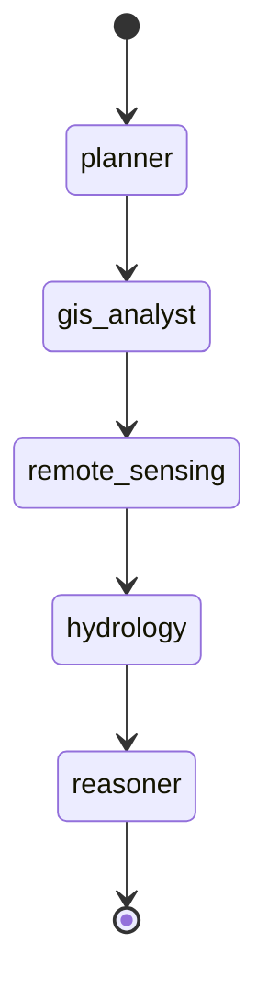
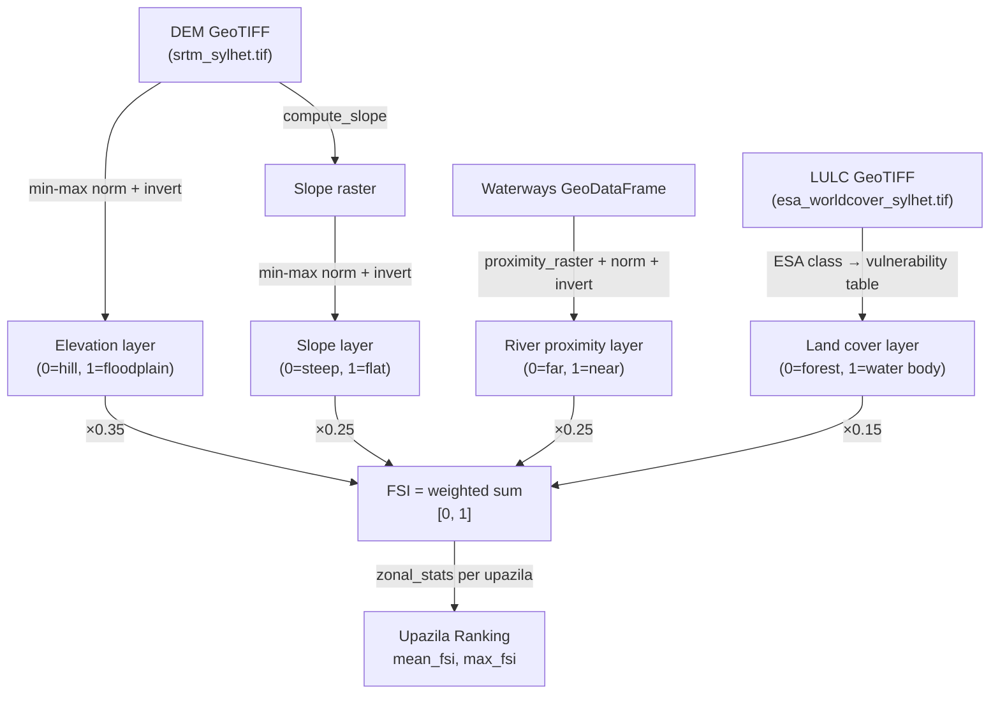
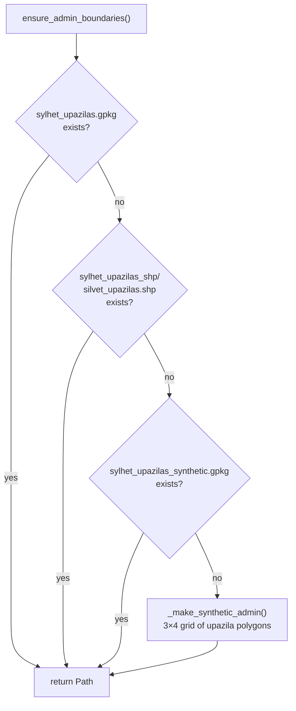
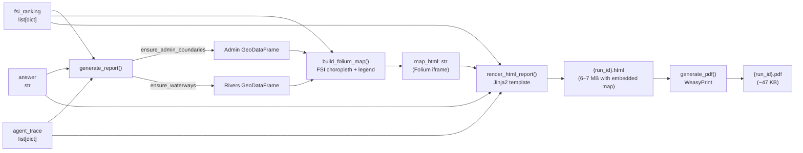
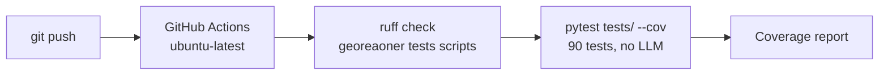

# GeoReasoner — Architecture Deep Dive

This document describes the internal design of every major subsystem.

---

## 1. Shared State (`georeasoner/state.py`)

All five LangGraph nodes communicate through a single typed dictionary:

```python
class GeoReasonerState(TypedDict):
    # Input
    query: str
    run_id: str

    # Planner output
    task_plan: list[dict]

    # GIS Analyst output — file paths, not in-memory objects
    admin_gdf_path:     str | None
    waterways_gdf_path: str | None

    # Remote Sensing output
    dem_path:  str | None
    lulc_path: str | None

    # Hydrology output
    fsi_raster_path: str | None
    fsi_ranking:     list[dict]

    # Reasoner output
    reasoning: str | None
    answer:    str | None

    # Cross-cutting
    agent_trace: Annotated[list[dict], operator.add]  # LangGraph reducer
    error:       str | None
```

**Key design decision:** Agents pass **file paths** between nodes, not in-memory GeoDataFrames or NumPy arrays. This:
- Avoids serialisation issues across the LangGraph state boundary
- Allows any agent to independently reload data using GeoPandas
- Keeps each node's memory footprint small

The `agent_trace` field uses LangGraph's `operator.add` reducer — each node appends `[new_entries]` and LangGraph accumulates them automatically.

---

## 2. LangGraph Graph (`georeasoner/graph.py`)



The graph is compiled once at application startup (`_graph = assemble_graph()`) and reused across all `/query` requests. Compilation validates the graph structure and pre-builds the state machine.

Each `invoke()` call creates an isolated state copy — concurrent requests are safe.

---

## 3. Agent Design Pattern

Every agent follows the same three-layer pattern:

```
┌─────────────────────────────────────────────────────┐
│  Layer 1 — LLM Tool-Calling                         │
│  • Call get_llm().bind_tools([tool1, tool2])        │
│  • Extract tool_calls from response                  │
│  • Execute each tool, collect results                │
└────────────────────┬────────────────────────────────┘
                     │ on any exception (ConnectionError,
                     │ TimeoutError, no tool calls returned)
                     ▼
┌─────────────────────────────────────────────────────┐
│  Layer 2 — Hard Fallback                            │
│  • Call tools directly with state-derived args      │
│  • Uses ensure_*() to resolve/create data paths     │
│  • Always produces a valid result                    │
└────────────────────┬────────────────────────────────┘
                     │
                     ▼
┌─────────────────────────────────────────────────────┐
│  Layer 3 — Trace + State Update                     │
│  • Append trace_entry() records to agent_trace      │
│  • Return updated state fields                       │
└─────────────────────────────────────────────────────┘
```

This design makes every agent **independently testable** and guarantees the full pipeline completes in CI without any running LLM.

---

## 4. Geospatial Tool Architecture

### `tools/vector_ops.py`

| Function | Description | Key Library |
|---|---|---|
| `buffer_features(gdf, distance_m)` | Metric-accurate buffer via UTM projection | GeoPandas, PyProj |
| `spatial_join(left, right, how, predicate)` | Spatial join with CRS alignment | GeoPandas |
| `clip_to_boundary(gdf, boundary)` | Clip vector to polygon boundary | GeoPandas |
| `overlay_difference(gdf, clip_gdf)` | Set difference overlay | GeoPandas |
| `proximity_raster(reference_gdf, like_raster_path)` | Distance raster from vector features | Rasterio, SciPy |

### `tools/raster_ops.py`

| Function | Description | Key Library |
|---|---|---|
| `compute_ndwi(src_path, green_band, nir_band)` | Normalised Difference Water Index | NumPy |
| `compute_slope(dem_path)` | Gradient-based slope (degrees) | NumPy |
| `reclassify_raster(data, class_map)` | Map class values to new values | NumPy |
| `zonal_stats(gdf, raster_path, stats)` | Raster statistics per polygon | Rasterio, GeoPandas |
| `write_raster(data, meta, output_path)` | Write NumPy array to GeoTIFF | Rasterio |

### `tools/hydrology_ops.py`



**ESA WorldCover class vulnerability mapping:**

| Class | Description | Vulnerability |
|---|---|---|
| 10 | Tree cover | 0.20 |
| 20 | Shrubland | 0.30 |
| 30 | Grassland | 0.50 |
| 40 | Cropland | 0.60 |
| 50 | Built-up | 0.70 |
| 60 | Bare/sparse | 0.50 |
| 80 | **Permanent water** | **1.00** |
| 90 | Herbaceous wetland | 0.95 |
| 95 | Mangroves | 0.80 |

---

## 5. Data Availability Strategy



The same priority pattern applies to all four data sources (admin, waterways, DEM, LULC). Real data is downloaded once by `scripts/fetch_data.py`; after that `ensure_*()` is a fast filesystem check.

---

## 6. Report Generation Pipeline



Both `.html` and `.pdf` are always written. The `GET /reports/{run_id}?format=` endpoint serves whichever is requested, falling back to the other format if needed.

---

## 7. Frontend State Management

```mermaid
flowchart TD
    QP["QueryPanelComponent\n(user types query, clicks Run)"]
    AS["AppStateService\nsignals: isRunning, result,\nstatuses, ranking, trace, error"]
    GS["GeoReasonerService\nHttpClient wrapper"]
    MV["MapViewComponent\nLeaflet choropleth"]
    WV["WorkflowViewComponent\nSVG pipeline graph"]
    LP["LogPanelComponent\nagent trace list"]
    RT["RankingTableComponent\nFSI bars"]

    QP -->|runAnalysis()| GS
    GS -->|POST /query| API["FastAPI :8000"]
    API -->|QueryResponse| GS
    GS -->|setDone(response)| AS

    AS -->|ranking signal| RT
    AS -->|ranking signal| MV
    AS -->|statuses signal| WV
    AS -->|trace signal| LP

    MV -->|POST /layers/fsi| API
    API -->|GeoJSON| MV
```

**Angular signals flow:**
1. User submits query → `state.setRunning()` → all agent nodes turn blue (running) in the workflow view
2. `/query` response arrives → `state.setDone(response)` → agents animate to green sequentially (350 ms delay each)
3. `MapViewComponent` picks up the `ranking` signal via `effect()` → fetches FSI GeoJSON → updates choropleth

---

## 8. CI/CD Pipeline



The CI workflow (`ci.yml`) installs system dependencies (`libspatialindex`, `libpango`, `libcairo`) via `apt-get`, installs Python deps with `pip install -e ".[dev]"`, runs linting, and executes the full test suite. No LM Studio is needed — all agent nodes use their fallback paths when `get_llm()` raises `ConnectionError`.

---

## 9. Deployment (Docker)

```
docker-compose.yml
  └── service: georeasoner
      ├── build: . (Dockerfile)
      ├── ports: 8000:8000
      ├── volumes: ./data:/app/data, ./reports:/app/reports
      ├── env: LM_STUDIO_BASE_URL=http://host.docker.internal:1234/v1
      └── extra_hosts: host.docker.internal:host-gateway
```

`host.docker.internal` routes the container's LM Studio calls to the host machine, enabling a locally-running LM Studio to serve the containerised application.

The Angular frontend is served separately in development. For production, build the Angular app (`ng build`) and serve the `dist/` folder via the FastAPI `StaticFiles` mount or a dedicated Nginx container.
