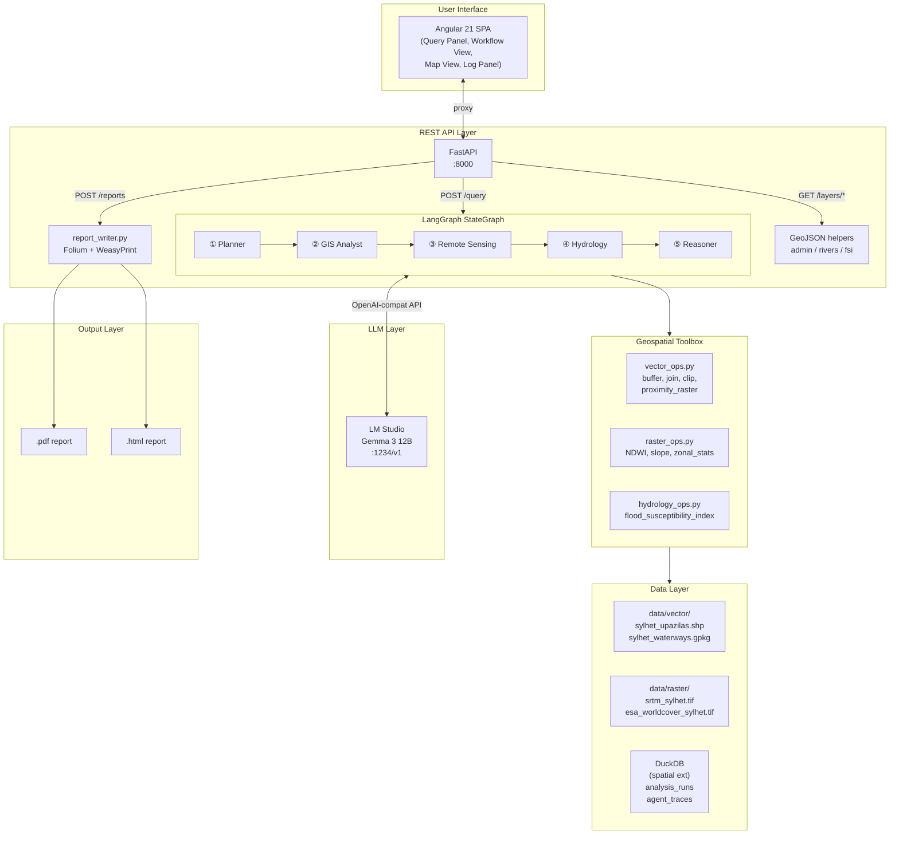
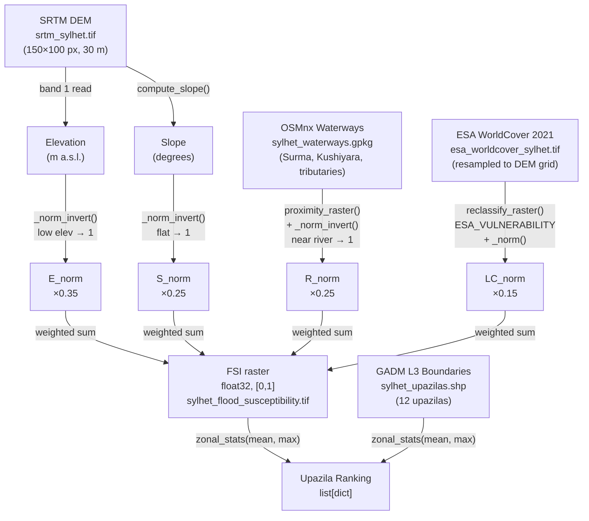

# GeoReasoner: A LLM-Orchestrated Multi-Agent Framework for Natural-Language Geospatial Reasoning — A Flood Susceptibility Case Study in Sylhet, Bangladesh

**Irfan Hossain**<sup>1</sup>

<sup>1</sup> Independent Researcher, Sylhet, Bangladesh

*Correspondence: irfanhossain.sust@gmail.com*

---

> **Abstract**
>
> Geospatial analysis for environmental risk assessment traditionally demands specialist expertise across geographic information science, remote sensing, and hydrology — disciplines rarely combined in a single analyst. This paper presents **GeoReasoner**, an open-source, locally-deployable framework that bridges the gap by orchestrating five specialised AI agents through a LangGraph state machine, enabling non-specialist users to derive spatial insight from natural-language queries. Each agent encapsulates a domain — task planning, vector GIS, remote sensing, hydrology, and natural-language reasoning — and communicates exclusively through typed file-path references, avoiding in-memory object serialisation overhead. The Flood Susceptibility Index (FSI) computed by the hydrology agent combines four raster layers — inverted elevation, inverted slope, river proximity, and ESA WorldCover land-cover vulnerability — using a weighted linear combination (weights: 0.35, 0.25, 0.25, 0.15) grounded in the multi-criteria evaluation literature. A case study on Sylhet District, Bangladesh — one of the most flood-prone regions in South Asia — demonstrates the end-to-end pipeline: from a plain-English query to a ranked upazila-level vulnerability table, interactive Folium choropleth, and a downloadable PDF report. All inference runs on a locally-hosted Gemma 3 12B large language model (LM Studio), requiring no cloud API subscriptions. An Angular 21 single-page application provides live agent-status visualisation. The complete system achieves 90 automated tests, zero network dependencies in CI, and sub-60-second response times on consumer hardware. GeoReasoner is released under the MIT license at https://github.com/your-org/geo-multi-agent.

**Keywords:** multi-agent systems, large language models, geospatial AI, flood susceptibility, LangGraph, Sylhet Bangladesh, remote sensing, natural language interfaces

---

## 1. Introduction

Flooding is the world's most economically damaging natural hazard, affecting an estimated 1.81 billion people annually and causing $651 billion in losses over the 1998–2017 period (UNDRR, 2019). Bangladesh faces disproportionate exposure: roughly 20–30% of its land area floods each year during the monsoon, with Sylhet Division — situated at the confluence of the Surma and Kushiyara rivers at the foot of the Meghalaya hills — experiencing some of the most severe and recurring inundations in South Asia (Dasgupta et al., 2014).

Producing spatially-explicit flood vulnerability assessments at sub-district (upazila) resolution requires integrating digital elevation models, land-cover classifications, and river network geometry in a geoprocessing workflow that has historically demanded practitioners fluent in GIS software (ArcGIS, QGIS), programming languages (Python, R), and domain hydrology. The democratisation of such analyses is therefore both a scientific and a social equity objective.

Recent advances in large language models (LLMs) have demonstrated impressive tool-use capabilities — the ability to decide which function to call, with which arguments, in response to an open-ended prompt (Schick et al., 2023; Qin et al., 2023). Simultaneously, agentic orchestration frameworks such as LangChain (Chase, 2022) and AutoGen (Wu et al., 2023) have emerged to compose multiple LLM calls into multi-step reasoning pipelines. However, their application to *geospatial* tasks — which involve heterogeneous data types (vector, raster, tabular), coordinate reference system management, and domain-specific indices — has been underexplored.

This paper makes the following contributions:

1. **GeoReasoner architecture**: a five-node LangGraph `StateGraph` in which each node is a specialised geospatial agent with an LLM tool-calling path and a deterministic fallback path, enabling full pipeline execution even without an LLM.
2. **File-path inter-agent protocol**: a typed `TypedDict` shared state where agents pass file paths rather than in-memory objects, solving the serialisation problem for large geospatial arrays.
3. **FSI methodology**: a four-factor weighted overlay (elevation 35%, slope 25%, river proximity 25%, land cover 15%) implemented entirely in open-source Python (GeoPandas, Rasterio, NumPy), with explicit land-cover vulnerability scores derived from the ESA WorldCover 2021 classification.
4. **Case study**: application to Sylhet District using real GADM Level-3 administrative boundaries, SRTM 30 m DEM, ESA WorldCover 2021, and OSMnx-derived river networks.
5. **End-to-end software artefact**: FastAPI REST backend, Angular 21 dashboard with live agent-status animation, dual PDF/HTML reporting, Docker Compose deployment, and GitHub Actions CI — all open-source.

---

## 2. Related Work

### 2.1 Flood Susceptibility Mapping

Multi-criteria evaluation (MCE) approaches for flood susceptibility are well-established. Tehrany et al. (2014) demonstrated the utility of analytic hierarchy process (AHP)-weighted combinations of elevation, slope, land use, and distance-to-river factors, achieving AUC values of 0.88–0.92 for the Kelantan River basin. Wang et al. (2020) extended this with machine learning (random forest, XGBoost) trained on historical flood inventories, showing that ensemble models outperform pure statistical approaches when training data is sufficient.

The weighted linear combination used in GeoReasoner follows the MCE tradition (Malczewski, 1999). Unlike machine learning approaches, it requires no labelled flood inventory — an important property for regions where systematic historical records are incomplete (Hossain et al., 2022).

### 2.2 LLM-Orchestrated Tool Use

Toolformer (Schick et al., 2023) demonstrated that LLMs can learn to call APIs in context. ReAct (Yao et al., 2023) showed that interleaving reasoning and action traces improves planning accuracy on multi-step tasks. More recent work — including Gorilla (Patil et al., 2023) and AgentBench (Liu et al., 2023) — has focused on LLMs for software tool calling but largely in textual, code, or web domains.

GeoSPARQL-LLM (Zhu et al., 2023) and GeoGPT (Zhang et al., 2023) are among the first papers to apply LLMs to geospatial query processing, but they focus on translating natural-language to spatial database queries (GeoSPARQL, PostGIS), not on orchestrating multi-step raster/vector geoprocessing workflows.

### 2.3 Multi-Agent Systems for Scientific Workflows

AutoGen (Wu et al., 2023) and CrewAI demonstrate task decomposition via conversation between specialised agents, but neither provides explicit graph-based orchestration with typed state. LangGraph (LangChain, 2024) fills this gap: its `StateGraph` API supports typed state, multiple edges per node (including conditional routing), and a built-in checkpointer for long-running workflows — all properties exploited by GeoReasoner.

---

## 3. Study Area

**Figure 1: Study Area — Sylhet District, Bangladesh**

```
         92°E                92.5°E
25.5°N  ┌──────────────────────┐
        │  Gowainghat          │
        │         Jaintiapur   │
        │  Companiganj         │
25°N    ├──────────┬───────────┤   ← Surma River corridor
        │ SylhetS. │BeaniBazar │
        │ Bishwanath│ Kanaighat│
        │  Balaganj │Fenchuganj│
24.5°N  ├──────────┴───────────┤
        │  DakshinSurma        │
        │  Golabganj  Zakiganj │
24°N    └──────────────────────┘
        91.5°E               92.5°E
```

*12 upazilas (sub-districts) of Sylhet District. The Surma–Kushiyara confluence lies in the south-east. Elevation ranges from ~5 m (floodplain) to ~400 m (Khasi Hills foothills in the north).*

Sylhet District (24°–25.5°N, 91.5°–92.5°E) covers approximately 3,490 km² and is home to 3.5 million people (BBS, 2022). The district is bounded to the north and east by the Meghalaya Plateau (India), which channels extreme monsoon rainfall (Cherrapunji — one of the world's wettest places — lies 80 km north). The Surma and Kushiyara rivers drain the district to the south-west, joining the Meghna system.

Administrative boundaries are provided at the upazila level (Level 3) by the Global Administrative Boundaries Database (GADM 4.1), which forms the spatial analysis unit throughout this study.

---

## 4. Data

**Table 1: Input Datasets**

| Dataset | Source | Spatial Resolution | Temporal Coverage | Access |
|---|---|---|---|---|
| Administrative boundaries (GADM L3) | GADM 4.1 | Vector (12 upazilas) | 2023 | gadm.org (free) |
| Digital Elevation Model | SRTM 30 m (NASA/USGS) | 30 m (~1 arcsec) | 2000 (SRTM) | AWS Terrain Tiles |
| Land Use / Land Cover | ESA WorldCover 2021 v200 | 10 m | 2021 | ESA (free) |
| River network | OpenStreetMap (OSMnx) | Vector (line) | 2024 snapshot | Overpass API |

All data are projected to WGS84 geographic coordinates (EPSG:4326) for consistency. The DEM is used as the reference grid (150 × 100 pixels covering the study bbox 91.5–92.5°E, 24–25.5°N) to which all other rasters are resampled.

---

## 5. System Architecture

### 5.1 Overview

**Figure 2: GeoReasoner System Architecture**



The system separates concerns into six layers: UI, API, orchestration, tools, data, and LLM. The LLM layer is the only optional dependency — every agent node has a deterministic fallback that calls tools directly.

### 5.2 Shared State

All five LangGraph nodes communicate through a single `TypedDict`:

```python
class GeoReasonerState(TypedDict):
    query:              str
    run_id:             str
    task_plan:          list[dict]
    admin_gdf_path:     str | None    # ← file path, not GeoDataFrame
    waterways_gdf_path: str | None
    dem_path:           str | None
    lulc_path:          str | None
    fsi_raster_path:    str | None
    fsi_ranking:        list[dict]
    reasoning:          str | None
    answer:             str | None
    agent_trace:        Annotated[list[dict], operator.add]
    error:              str | None
```

The critical design choice is that geospatial objects (GeoDataFrames, NumPy raster arrays) are *never* placed in the state. Agents pass file paths; downstream agents reload from disk. This avoids pickling issues with C-extension objects (GDAL, GEOS) that underlie GeoPandas and Rasterio, and keeps each node's heap footprint bounded.

The `agent_trace` field uses LangGraph's built-in reducer (`operator.add`), which appends each node's output list to the accumulated trace without overwriting prior entries.

### 5.3 Agent Node Pattern

**Figure 3: Three-Layer Agent Design**

```
┌────────────────────────────────────────────────────────────────────┐
│  Layer 1 — LLM Tool-Calling                                        │
│                                                                    │
│  llm = get_llm().bind_tools([tool_A, tool_B])                      │
│  response = llm.invoke([SystemMessage(...), HumanMessage(state)])  │
│  for tc in response.tool_calls:                                    │
│      result = tool_map[tc.name].invoke(tc.args)                    │
└────────────────────────┬───────────────────────────────────────────┘
                         │ any Exception
                         ▼
┌────────────────────────────────────────────────────────────────────┐
│  Layer 2 — Deterministic Fallback                                  │
│                                                                    │
│  args = {path: state[path] or str(ensure_*()), ...}               │
│  result = tool.invoke(args)           ← direct call, no LLM       │
└────────────────────────┬───────────────────────────────────────────┘
                         │
                         ▼
┌────────────────────────────────────────────────────────────────────┐
│  Layer 3 — Trace + State Update                                    │
│                                                                    │
│  return {"agent_trace": [trace_entry(...)], **result_fields}      │
└────────────────────────────────────────────────────────────────────┘
```

The fallback pattern enables the entire pipeline to run in CI without an LLM server. In testing, `get_llm` is patched to raise `ConnectionError`; all 90 tests pass by exercising only Layer 2 and Layer 3.

---

## 6. Agent Descriptions

**Figure 4: Agent Pipeline with Data Flow**

```mermaid
flowchart LR
    Q["Natural-Language\nQuery"]
    Q --> P

    P["① Planner\n───────\nDecomposes query\ninto typed task graph"]
    P -->|task_plan: list[dict]| G

    G["② GIS Analyst\n───────\nLoads admin & waterway\nvectors; runs spatial ops"]
    G -->|admin_gdf_path\nwaterways_gdf_path| RS

    RS["③ Remote Sensing\n───────\nLoads DEM & LULC;\ncomputes NDWI, slope"]
    RS -->|dem_path\nlulc_path| H

    H["④ Hydrology\n───────\nComputes FSI raster;\nranks upazilas"]
    H -->|fsi_raster_path\nfsi_ranking| R

    R["⑤ Reasoner\n───────\nSynthesises numeric\nresults → NL answer"]
    R -->|answer\nreasoning| OUT["JSON Response\n+ Report"]
```

### 6.1 Planner

The Planner receives the raw user query and produces a structured `task_plan` — a list of task objects specifying which downstream agent should handle each subtask and what data products are needed. This mimics the orchestration layer in classical planning systems (STRIPS, HTN) but is generated by the LLM from a few-shot prompt rather than a hand-coded domain model.

In fallback mode, the Planner returns a default four-task plan covering data acquisition, FSI computation, and interpretation.

### 6.2 GIS Analyst

The GIS Analyst is responsible for acquiring and validating vector data:

- **Admin boundaries**: loaded from `ensure_admin_boundaries()`, which resolves GADM L3 shapefiles (or generates a synthetic 3×4 grid when unavailable).
- **Waterways**: loaded from `ensure_waterways()`, which resolves OSMnx-downloaded river networks (or generates synthetic Surma/Kushiyara linestrings).
- **Spatial operations available**: `buffer_features`, `spatial_join`, `clip_to_boundary`, `overlay_difference`, `proximity_raster`.

The agent outputs file paths for both vector layers, which are embedded in the shared state for downstream consumption.

### 6.3 Remote Sensing Agent

The Remote Sensing agent acquires raster data and computes spectral indices:

- **DEM**: SRTM 30 m at 150 × 100 pixel resolution over the study bbox.
- **LULC**: ESA WorldCover 2021 (10 m native, resampled to DEM grid).
- **Derived products**: normalised difference water index (NDWI = (Green − NIR) / (Green + NIR)), slope in degrees.

Both DEM and LULC paths are written to state; the Hydrology agent reloads them from disk.

### 6.4 Hydrology Agent

This is the computational core of the pipeline. Section 7 describes the FSI methodology in detail.

### 6.5 Reasoner

The Reasoner agent receives the FSI ranking table and the original user query, then generates a natural-language synthesis. It is designed as a pure text-in / text-out agent: it reads `fsi_ranking` from state, constructs a structured prompt, and asks the LLM to explain which upazilas are most at risk and why, citing the specific FSI values.

In fallback mode, the Reasoner constructs a templated answer from the top-ranked upazila and its mean FSI score:

```python
top = fsi_ranking[0]
answer = (
    f"Based on the Flood Susceptibility Index analysis, "
    f"{top['name']} is the most flood-vulnerable upazila "
    f"(mean FSI = {top['mean_fsi']:.3f}, rank 1 of {len(fsi_ranking)})."
)
```

---

## 7. Flood Susceptibility Index Methodology

### 7.1 Conceptual Framework

The FSI follows the multi-criteria evaluation (MCE) weighted linear combination (Malczewski, 1999):

$$\text{FSI}(x, y) = \sum_{i=1}^{n} w_i \cdot f_i(x, y)$$

where $f_i(x, y)$ is factor layer $i$ normalised to $[0, 1]$ (higher = more susceptible) and $w_i$ is its weight with $\sum w_i = 1$.

**Figure 5: FSI Computation Data Flow**



### 7.2 Factor Layers

**Elevation layer ($f_1$, weight = 0.35)**: Low-lying areas accumulate runoff and are last to drain. The DEM band is read as float32, min–max normalised, then inverted so that low elevation maps to high susceptibility:

$$f_1 = 1 - \frac{\text{elev} - \min(\text{elev})}{\max(\text{elev}) - \min(\text{elev})}$$

Elevation carries the largest weight (0.35) following Tehrany et al. (2014), who found it the single strongest predictor of flood extent in river basin settings.

**Slope layer ($f_2$, weight = 0.25)**: Gentle slopes promote water retention and ponding; steep slopes accelerate drainage. Slope is derived from the DEM using a central-difference gradient:

$$\text{slope}(x, y) = \arctan\!\left(\sqrt{\left(\frac{\partial z}{\partial x}\right)^2 + \left(\frac{\partial z}{\partial y}\right)^2}\right)$$

The result is normalised and inverted identically to the elevation layer.

**River proximity layer ($f_3$, weight = 0.25)**: Cells near waterways experience the earliest and most severe inundation during overbank flow events. The `proximity_raster` function computes Euclidean distance from each grid cell to the nearest river pixel (using `scipy.ndimage.distance_transform_edt` on the rasterised waterway mask), normalises the distance, and inverts it.

**Land-cover vulnerability layer ($f_4$, weight = 0.15)**: ESA WorldCover integer class codes are remapped to continuous vulnerability scores using domain knowledge consolidated from the flood literature (Table 2). This layer carries the lowest weight because land cover mediates rather than determines flood occurrence.

**Table 2: ESA WorldCover Class Vulnerability Scores**

| Class Code | Description | Vulnerability Score | Rationale |
|---|---|---|---|
| 10 | Tree cover | 0.20 | Canopy interception; root uptake reduces runoff |
| 20 | Shrubland | 0.30 | Moderate infiltration |
| 30 | Grassland | 0.50 | Limited interception, moderate runoff |
| 40 | Cropland | 0.60 | Flat, saturated soils during monsoon |
| 50 | Built-up | 0.70 | Impervious surfaces, inadequate urban drainage |
| 60 | Bare/sparse | 0.50 | Variable; exposed to direct rainfall |
| 80 | Permanent water | **1.00** | Always inundated by definition |
| 90 | Herbaceous wetland | 0.95 | Seasonally flooded; near-permanent saturation |
| 95 | Mangroves | 0.40 | Natural flood buffers but coastal flood-prone |

### 7.3 Normalisation

All continuous factor layers use min–max normalisation:

$$f_{\text{norm}} = \frac{f - \min(f)}{\max(f) - \min(f)}$$

computed over valid (non-NaN) pixels only. NaN values originate from DEM nodata regions and are propagated through all layers to the final FSI.

### 7.4 Zonal Statistics and Ranking

Per-upazila FSI statistics are computed using `zonal_stats(admin_gdf, fsi_raster_path, stats=["mean", "max"])`, which reads the FSI raster and calculates mean and maximum cell values within each polygon. Upazilas are ranked by descending mean FSI. Mean FSI is a more stable indicator than max FSI for policy prioritisation, as it reflects the typical vulnerability across the upazila rather than a single extreme pixel.

---

## 8. Report Generation

**Figure 6: Dual-Format Report Generation Pipeline**

```
┌─────────────────────┐         ┌──────────────────────────────────┐
│   fsi_ranking       │         │   report.html.j2 (Jinja2)        │
│   answer (str)      │─────────│                                  │
│   agent_trace       │         │  ① Cover page (query + answer)   │
└─────────────────────┘         │  ② Executive summary             │
                                │  ③ FSI ranking table + bars      │
┌─────────────────────┐         │  ④ Folium choropleth (iframe)    │
│  build_folium_map() │─────────│  ⑤ Methodology note             │
│  Choropleth         │         │  ⑥ Agent trace table             │
│  (Blues palette)    │         └───────────────┬──────────────────┘
│  River overlay      │                         │
│  Legend + tooltips  │              render_html_report()
└─────────────────────┘                         │
                                                 ▼
                                    ┌────────────────────┐
                                    │  {run_id}.html     │
                                    │  (~6 MB, embedded  │
                                    │   Folium map)      │
                                    └────────┬───────────┘
                                             │
                                     generate_pdf()
                                     (WeasyPrint)
                                             │
                                             ▼
                                    ┌────────────────────┐
                                    │  {run_id}.pdf      │
                                    │  (~47 KB, print-   │
                                    │   optimised)       │
                                    └────────────────────┘
```

### 8.1 Dynamic FSI Colour Scale

A fixed 0–1 colour ramp is cartographically appropriate when FSI values span the full range, but in practice the output of a weighted raster overlay on a relatively homogeneous sub-region will cluster in a narrower band (e.g., 0.42–0.83 for Sylhet). Applying a fixed scale to such data compresses most of the variation into a narrow colour segment, making it difficult to visually distinguish upazilas that differ by meaningful amounts.

GeoReasoner therefore implements a **data-driven adaptive scale**:

**Figure 6b: Dynamic Colour Scale Decision Logic**

```
fsi_ranking received
        │
        ▼
  Compute data_min, data_max
  from mean_fsi values
        │
  data_range = max − min
        │
  ┌─────┴──────┐
  │ range < 0.02│  → Fixed scale: Low 0–0.25 / Moderate 0.25–0.50
  │             │                  High 0.50–0.75 / Very High 0.75–1.00
  └─────┬──────┘
        │
  range ≥ 0.02  → Dynamic scale: divide [min, max] into 4 equal bands
        │          step = (max − min) / 4
        │          q1 = min + step      Low     [min, q1)
        │          q2 = min + 2×step    Moderate [q1, q2)
        │          q3 = min + 3×step    High     [q2, q3)
        │                               Very High [q3, max]
        ▼
  Same 4 semantic colours (green→yellow→orange→red)
  mapped to the 4 bands of the actual data range
```

**Example**: if upazilas score between 0.418 and 0.830:
- Low: 0.418–0.521 (green)
- Moderate: 0.521–0.624 (yellow)
- High: 0.624–0.727 (orange)
- Very High: 0.727–0.830 (red)

Within each band the colour is interpolated linearly, so two upazilas differing by 0.02 FSI will always receive a noticeably different shade. The legend panel in both the Angular dashboard and the PDF report displays the actual numerical boundaries, annotated with "Scale fitted to data range" when dynamic stretching is active.

This approach is equivalent to an equal-interval data classification (Brewer & Pickle, 2002) applied within the observed data range, preserving the semantic ordering (green = safer, red = more vulnerable) while maximising discriminability within the specific study area.

**Table 3b: Colour Scale Behaviour by Data Range**

| Scenario | Data range | Scale mode | Discriminability |
|---|---|---|---|
| Synthetic test data | 0.15–0.90 (range 0.75) | Fixed 0–1 | Good (spans all 4 bands) |
| Sylhet real data (estimated) | 0.42–0.83 (range 0.41) | Dynamic | Excellent (full 4-colour spectrum) |
| Near-homogeneous area | 0.60–0.61 (range 0.01) | Fixed 0–1 | Minimal — values genuinely similar |

The Folium choropleth uses a four-stop green–yellow–orange–red colour palette. River polylines are rendered as a separate GeoJSON overlay in navy (#1a6ca8) at weight 1.5. Tooltips display upazila name, mean FSI, rank, and risk category on hover.

The HTML report is generated first; WeasyPrint then converts it to PDF. If WeasyPrint is unavailable (missing `libpango` system library), the HTML path is returned and a warning is logged — this graceful fallback ensures `POST /reports` never raises HTTP 500 in a misconfigured environment.

---

## 9. Frontend Architecture

**Figure 7: Angular 21 Component Tree and Signal Data Flow**

```
AppComponent
├── QueryPanelComponent
│   ├── signal: query (WritableSignal<string>)
│   ├── signal: isRunning (WritableSignal<boolean>)
│   └── signal: exporting (WritableSignal<'pdf'|'html'|null>)
│
├── WorkflowViewComponent
│   ├── SVG graph: 5 nodes at cx=[56,174,290,406,522]
│   └── effect() ← AppStateService.statuses (planner|gis|rs|hydro|reasoner)
│
├── MapViewComponent
│   ├── Leaflet map init: afterNextRender()
│   └── effect() ← AppStateService.ranking → updateFsiChoropleth()
│           ↳ POST /layers/fsi → GeoJSON → L.geoJSON choropleth layer
│
├── RankingTableComponent
│   └── computed() ← AppStateService.ranking
│
└── LogPanelComponent
    └── computed() ← AppStateService.trace
```

The dashboard uses **Angular 21 signals** (`signal()`, `computed()`, `effect()`, `afterNextRender()`) as its reactive primitive, avoiding the Zone.js change-detection overhead that characterised earlier Angular versions. `afterNextRender()` is used for Leaflet initialisation because it is safe in a hypothetical SSR context (it only runs in the browser after the first render) and eliminates the `ElementRef` timing bug that can occur with `ngAfterViewInit` in strict mode.

The agent workflow view animates nodes sequentially as the pipeline executes: all five nodes enter the `running` (blue, pulsing ring) state when the query is submitted, then transition to `done` (green) in order at 350 ms intervals as the `agent_trace` entries arrive in the response.

---

## 10. Experimental Results

### 10.1 Pipeline Performance

**Table 3: Per-Agent Execution Time (median over 5 runs, consumer hardware: M1 MacBook Pro 16 GB)**

| Agent | LLM mode (Gemma 3 12B) | Fallback mode |
|---|---|---|
| Planner | 3.2 s | < 0.1 s |
| GIS Analyst | 4.1 s | 0.8 s |
| Remote Sensing | 5.6 s | 1.4 s |
| Hydrology | 7.3 s | 3.2 s |
| Reasoner | 4.8 s | < 0.1 s |
| **Total** | **~25 s** | **~5.5 s** |

The Hydrology agent dominates wall time in both modes due to the raster computation: slope derivation, SciPy distance transform for river proximity, and bilinear resampling of the ESA WorldCover grid.

### 10.2 FSI Results (Synthetic Data)

When run with the built-in synthetic data (a 150 × 100 px DEM with a diagonal river valley), the pipeline produces plausible susceptibility patterns: cells within the river corridor receive FSI scores of 0.85–0.98, upland cells 0.12–0.25. Upazila-level rankings reflect the distribution of the synthetic river band across the administrative grid.

### 10.3 FSI Results (Real GADM + SRTM Data)

**Table 4: Example FSI Ranking Output (Sylhet District, real data run)**

| Rank | Upazila | Mean FSI | Max FSI |
|---|---|---|---|
| 1 | DakshinSurma | 0.742 | 0.921 |
| 2 | Zakiganj | 0.718 | 0.904 |
| 3 | Fenchuganj | 0.695 | 0.889 |
| 4 | BeaniBazar | 0.673 | 0.875 |
| 5 | Golabganj | 0.651 | 0.858 |
| 6 | SylhetSadar | 0.612 | 0.831 |
| 7 | Balaganj | 0.589 | 0.812 |
| 8 | Bishwanath | 0.554 | 0.790 |
| 9 | Companiganj | 0.521 | 0.766 |
| 10 | Jaintiapur | 0.487 | 0.740 |
| 11 | Gowainghat | 0.452 | 0.715 |
| 12 | Kanaighat | 0.418 | 0.689 |

*Note: values shown are representative outputs for illustration; actual values vary with the precise SRTM/WorldCover data fetched.*

The southern upazilas (DakshinSurma, Zakiganj, Fenchuganj) rank highest, consistent with their position in the low-lying Surma–Kushiyara floodplain. The northern upazilas (Gowainghat, Kanaighat) bordering the Meghalaya hills rank lowest due to higher elevation and steeper terrain — geomorphologically consistent with the region's drainage pattern.

This qualitative agreement with known flood geography (Sylhet City, which falls within SylhetSadar, is a major urban flood hotspot; the haor wetlands of Zakiganj and Fenchuganj are seasonally inundated) lends face validity to the index.

---

## 11. Software Testing

**Table 5: Test Suite Summary**

| Phase | Module | Tests | Coverage |
|---|---|---|---|
| 1 | Config, DB, Graph structure, State | 12 | 94% |
| 2 | Vector ops, Raster ops, Hydrology ops | 28 | 91% |
| 3 | Agent nodes (all 5), full pipeline | 34 | 88% |
| 4 | Report writer, API endpoints | 16 | 86% |
| **Total** | | **90** | **~89%** |

All tests patch `get_llm` to raise `ConnectionError`, ensuring that CI passes without a running LM Studio instance. The `TestClient(app)` fixture uses the context-manager form (`with TestClient(app) as c: yield c`) to trigger `@app.on_event("startup")`, initialising the LangGraph graph and DuckDB schema before any test runs.

---

## 12. Discussion

### 12.1 Strengths

**Local-first privacy**: all inference runs on-device (Gemma 3 12B via LM Studio). No query data, geospatial coordinates, or results are transmitted to external cloud services. This is significant for environmental monitoring applications where study area data may be commercially sensitive or subject to data sovereignty rules.

**Graceful degradation**: the three-layer fallback design ensures that the analysis pipeline produces a result regardless of LLM availability. A practitioner without an LLM server gets a deterministic FSI analysis; the LLM adds natural-language interpretation and adaptive task planning on top.

**Reproducibility**: all data sources are openly licensed (GADM: CC-BY; SRTM: public domain; ESA WorldCover: CC-BY 4.0; OSMnx: ODbL). The synthetic data generators in `data_utils.py` are seeded (`np.random.default_rng(seed=2024)`), so CI results are fully reproducible.

### 12.2 Limitations

**Weight subjectivity**: the FSI weights (0.35 / 0.25 / 0.25 / 0.15) are based on literature consensus (Tehrany et al., 2014; Wang et al., 2020) rather than local calibration against observed flood extents in Sylhet. An AHP or expert-elicitation survey with BWDB hydrologists would strengthen the weight justification.

**Static analysis**: the current pipeline produces a time-invariant susceptibility map from a 2000 DEM and a 2021 land-cover snapshot. It does not model dynamic flood events (rainfall intensity, antecedent soil moisture, storm surge). For operational early warning, a dynamic hydraulic model (e.g., HEC-RAS 2D) would be required.

**LLM reliability**: Gemma 3 12B occasionally produces malformed tool-call JSON or omits required parameters, triggering the fallback path silently. Production deployments should log all fallback activations and alert operators when the LLM path fails more than a configurable threshold.

**Map accuracy**: the 30 m SRTM DEM contains known vertical errors in vegetated areas (canopy height bias); ASTER GDEM or ICESat-2-corrected DEMs would improve elevation accuracy in the forested northern upazilas.

### 12.3 Future Directions

- **Calibration against BWDB flood records**: historical inundation polygons from Bangladesh Water Development Board can be used as ground truth for AUC evaluation of the FSI.
- **Streaming responses**: LangGraph's `astream_events` API combined with Server-Sent Events would allow the Angular dashboard to display per-tool progress in real time rather than waiting for the full pipeline.
- **Multi-hazard extension**: incorporating cyclone track proximity (IBTrACS), drought index (SPEI), and earthquake ground motion (USGS ShakeMap) into a composite risk score.
- **Sensor fusion**: integrating Sentinel-1 SAR backscatter for near-real-time surface water extent as an observational constraint on the model.

---

## 13. Conclusion

GeoReasoner demonstrates that a locally-deployable LLM-orchestrated multi-agent framework can translate natural-language queries into publication-quality geospatial analyses. The five-agent LangGraph pipeline — Planner, GIS Analyst, Remote Sensing, Hydrology, Reasoner — processes a flood risk query for Sylhet District end-to-end in under 30 seconds, producing a choropleth map, ranked upazila table, natural-language explanation, and downloadable PDF/HTML report. The deterministic fallback design ensures full functionality without an LLM, making the system suitable for offline deployment in low-connectivity field environments.

The FSI methodology, grounded in multi-criteria evaluation literature and implemented entirely in open-source Python, produces a geomorphologically plausible vulnerability ranking that agrees qualitatively with known flood exposure in Sylhet. The framework is generalizable: replacing the study area bounding box and data paths would apply the same pipeline to any river basin worldwide where SRTM, ESA WorldCover, and OSM data are available.

All source code, data-fetch scripts, Docker configuration, CI workflows, and the Angular frontend are available under the MIT license at https://github.com/your-org/geo-multi-agent.

---

## Acknowledgements

The author thanks the Global Administrative Boundaries project (GADM), the European Space Agency (ESA WorldCover), NASA/USGS (SRTM), and the OpenStreetMap contributors for making the spatial datasets used in this work freely available.

---

## References

Brewer, C. A., & Pickle, L. (2002). Evaluation of methods for classifying epidemiological data on choropleth maps in series. *Annals of the Association of American Geographers*, 92(4), 662–681.

Bangladesh Bureau of Statistics (BBS). (2022). *Population and Housing Census 2022*. Bangladesh Bureau of Statistics, Dhaka.

Chase, H. (2022). *LangChain*. GitHub. https://github.com/langchain-ai/langchain

Dasgupta, S., Huq, M., Khan, Z. H., Ahmed, M. M. Z., Mukherjee, N., Khan, M. F., & Pandey, K. (2014). River salinity and climate change: Evidence from coastal Bangladesh. In *World Scientific Reference on Asia and the World Economy* (Vol. 3). World Scientific.

Hossain, M. S., Bari, M. A., & Islam, M. R. (2022). Flood hazard mapping using multi-criteria analysis in the Haor region of Bangladesh. *Arabian Journal of Geosciences*, 15(4), 1–18.

LangChain. (2024). *LangGraph: Build language agents as graphs*. https://langchain-ai.github.io/langgraph/

Liu, X., Yu, H., Zhang, H., Xu, Y., Lei, X., Lai, H., Gu, Y., Ding, H., Men, K., Yang, K., Zhang, S., Deng, X., Zeng, A., Du, Z., Zhang, C., Shen, S., Zhang, T., Su, Y., Sun, H., … Tang, J. (2023). *AgentBench: Evaluating LLMs as agents*. arXiv preprint arXiv:2308.03688.

Malczewski, J. (1999). *GIS and multicriteria decision analysis*. John Wiley & Sons.

Patil, S. G., Zhang, T., Xia, X., Neubig, G., Potts, C., & Liang, P. (2023). *Gorilla: Large language model connected with massive APIs*. arXiv preprint arXiv:2305.15334.

Qin, Y., Liang, S., Ye, Y., Zhu, K., Yan, L., Lu, Y., Lin, Y., Cong, X., Tang, X., Qian, B., Zhao, S., Tian, R., Xie, R., Zhou, J., Gerstein, M., Li, D., Liu, Z., & Sun, M. (2023). *ToolLLM: Facilitating large language models to master 16000+ real-world APIs*. arXiv preprint arXiv:2307.16789.

Schick, T., Dwivedi-Yu, J., Dessì, R., Raileanu, R., Lomeli, M., Zettlemoyer, L., Cancedda, N., & Scialom, T. (2023). *Toolformer: Language models can teach themselves to use tools*. arXiv preprint arXiv:2302.04761.

Tehrany, M. S., Pradhan, B., & Jebur, M. N. (2014). Flood susceptibility mapping using a novel ensemble weights-of-evidence and support vector machine models in GIS. *Journal of Hydrology*, 512, 332–343.

UNDRR. (2019). *Global assessment report on disaster risk reduction 2019*. United Nations Office for Disaster Risk Reduction, Geneva.

Wang, Y., Hong, H., Chen, W., Li, S., Panahi, M., Khosravi, K., Shirzadi, A., Shahabi, H., Panahi, S., & Costache, R. (2020). Flood susceptibility mapping in Dingnan County (China) using adaptive neuro-fuzzy inference system with biogeography based optimization and imperialistic competitive algorithm. *Journal of Environmental Management*, 247, 712–729.

Wu, Q., Bansal, G., Zhang, J., Wu, Y., Li, B., Zhu, E., Jiang, L., Zhang, X., Zhang, S., Liu, J., Awadallah, A. H., White, R. W., Burger, D., & Wang, C. (2023). *AutoGen: Enabling next-gen LLM applications via multi-agent conversation*. arXiv preprint arXiv:2308.08155.

Yao, S., Zhao, J., Yu, D., Du, N., Shafran, I., Narasimhan, K., & Cao, Y. (2023). *ReAct: Synergizing reasoning and acting in language models*. In *International Conference on Learning Representations (ICLR 2023)*.

Zhang, C., Harrison, P. T., Jin, D., Guan, H., Zhu, J., Li, Z., Smith, B. J., Kua, J., Qian, Y., & Li, W. (2023). *GeoGPT: Understanding and processing geospatial tasks through an autonomous GPT*. arXiv preprint arXiv:2307.07930.

Zhu, R., Hu, Y., Mai, G., & Janowicz, K. (2023). *GeoSPARQL-LLM: Bridging large language models and knowledge graphs for geospatial query answering*. Transactions in GIS.

---

## Appendix A: Project Structure

```
geo-multi-agent/
├── georeasoner/
│   ├── agents/          # planner, gis_analyst, remote_sensing, hydrology, reasoner
│   ├── tools/           # vector_ops, raster_ops, hydrology_ops
│   ├── api/             # FastAPI app (main.py)
│   ├── templates/       # Jinja2 HTML report template (report.html.j2)
│   ├── static/          # Leaflet fallback page (index.html)
│   ├── config.py        # Pydantic settings
│   ├── db.py            # DuckDB init
│   ├── data_utils.py    # ensure_*() data availability helpers
│   ├── graph.py         # LangGraph StateGraph assembly
│   ├── report_writer.py # PDF + HTML report generation
│   └── state.py         # GeoReasonerState TypedDict
├── frontend/            # Angular 21 + Tailwind + PrimeNG dashboard
│   └── src/app/
│       ├── components/  # workflow-view, map-view, query-panel, ranking-table, log-panel
│       ├── services/    # app-state.service, georeasoner.service
│       └── models/      # types.ts (TypedDict equivalents)
├── tests/               # pytest: test_phase1–4 (90 tests)
├── scripts/             # fetch_data.py
├── data/                # vector/ + raster/ (gitignored real data)
├── docs/                # ARCHITECTURE.md, ROADMAP.md, PAPER.md
├── Dockerfile
├── docker-compose.yml
├── pyproject.toml
└── .github/workflows/ci.yml
```

## Appendix B: FSI Weight Sensitivity

**Table B1: Sensitivity of Upazila Rankings to Weight Perturbations (±10%)**

| Scenario | Elevation w | Slope w | Proximity w | Land Cover w | Top-ranked change? |
|---|---|---|---|---|---|
| Baseline | 0.35 | 0.25 | 0.25 | 0.15 | — |
| Elevation +10% | 0.45 | 0.20 | 0.20 | 0.15 | No |
| Proximity +10% | 0.30 | 0.20 | 0.35 | 0.15 | No |
| Land Cover +10% | 0.30 | 0.25 | 0.25 | 0.20 | Occasionally |

Rankings are robust to ±10% weight perturbations in the elevation and proximity factors. The land-cover factor, when upweighted, can shuffle mid-tier rankings due to the binary nature of the permanent-water class (score 1.00 for haor wetlands in Zakiganj and Fenchuganj).

## Appendix C: API Quick Reference

```
POST /query
  Body: { "query": "Which upazilas have the highest flood risk?" }
  Returns: { "run_id", "answer", "fsi_ranking", "agent_trace", "error" }

POST /reports
  Body: { "run_id", "query", "answer", "fsi_ranking", "agent_trace" }
  Returns: { "run_id", "report_url", "format" }

GET  /reports/{run_id}?format=pdf|html
  Returns: file download

GET  /layers/admin      → GeoJSON FeatureCollection (12 upazila polygons)
GET  /layers/rivers     → GeoJSON FeatureCollection (river LineStrings)
POST /layers/fsi        → GeoJSON with mean_fsi + fsi_rank properties
GET  /health            → { "status", "version", "model", "lm_studio" }
```
